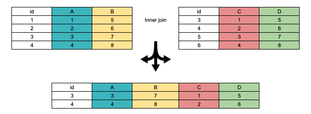

```{r setup, include=FALSE}
knitr::opts_chunk$set(echo = TRUE,
                      message=FALSE,
                      warning=FALSE)
```


## Introdução

Um dos propósitos do [curso sobre ciência de dados com R e PostgreSQL](https://rpsql.consudata.com.br/syllabus.html) é mostrar como realizar as mesmas tarefas nas duas linguagens. Um bom exemplo são as junções ou joins, as quais permitem combinar tabelas ou vetores para gerar uma nova tabela. Você pode emparelhá-las verticalmente, horizontalmente ou criar um produto cartesiano. 

No emparelhamento vertical, exige-se que as colunas tenham o mesmo nome e os tipos sejam os mesmos. No horizontal, exige-se que os tamanhos da colunas ou vetores sejam os mesmos. Desses tipos de combinações, tratamos em outro [tutorial](https://app.consudata.com.br/rpsql/bind_filter).

Neste tutorial, iremos falar de combinações, ou melhor, junções, que pressupõem a comparação entre valores de colunas conforme especificação pelo usuário. Essas junções criam tabelas novas, as quais não se confundem com as tabelas originais e que não necessariamente preservam todas as colunas e todas as linhas. Por esta razão, é importante ter claro o que se quer ao juntar tabelas para evitar resultados indesejados. A imagem abaixo ilustra uma operação de inner join.

```{r layout="l-body-outset", fig.width=4, echo = FALSE}

```


Junções no **R** e no PostgreSQL podem ser usadas para diferentes propósitos. No **R** junções são úteis no processo de transformação dos dados, ou seja, geralmente extraímos dados de diferentes fontes e queremos juntá-los para compor novos dados. Por vezes, a junção é um passo intermediário na programação sem qualquer fim em si mesma.

Já no PostgreSQL, a junção é geralmente realizada nas buscas de tabelas normalizadas, ou seja, quando as informações a serem passadas para o cliente via query estão dispersas em várias tabelas. Ademais, servem para denormalizar o banco a fim de melhorar o desempenho de queries.

Em suma, no **R** junções são especialmente usadas como técnica de programação e manuseio de dados, em SQL como estratégia de armazenamento e extração (queries) de dados.

Além disso, como no **R** a ordem em que aparecem os valores num vetor importa, adicionar uma coluna ao dataframe é uma mera questão de emparelhamento, ou seja, usando `df$nova_coluna <- vetor_externo` ou `tibble::add_column(df,nova_coluna = vetor_externo)`. Por sua vez, SQL não possui noção de ordem, de modo que o emparelhamento  horizontal se faz por meio de joins.

Antes de realizar joins, tente responder para si mesma questões como:

1 - Quero preservar todas as linhas das duas tabelas?

2 - Quero preservar todas as linhas de apenas uma tabela?

3 - Quero preservar todas as colunas de ambas tabelas?

4 - Quero preservar NAs (no **R**) ou NULLs no **PostgreSQL**?

5 - Quero juntar as tabelas com base na comparação de apenas um par de colunas, ou seja, coluna a da tbl1 com coluna b da tbl2? 

6 - Se fizer conforme a pergunta 5, o que vai acontecer com colunas com o mesmo nome nas duas tabelas, mas que não pretendo comparar para efeitos de junção?

7 - Quero valores das duas tabelas ou apenas de uma?

## Pacotes necessários

Para você não ser tomada de surpresa, vamos carregar os pacotes necessários logo no início. Assim, se você não tiver algum deles, trate de instalá-los.

```{r}
library(dplyr)
library(tibble)
library(pander)
library(DBI)
```


## Joins no R com Tidyverse

No **R** base, existe a função merge. No entanto, eu irei adotar a abordagem tidyverse para os joins. Uma das razões para usar o tidyverse é o fato de ele ser bem documentado. 

Um dos pacotes mais importantes do tidyverse é o dplyr. Ele possui dois grupos de joins. Um grupo de joins de mutação, composto pelos seguintes joins:

1 - inner_join = mantêm todas as linhas de x e de y;

2 - left_join = mantêm todas as linhas de x;

3 - right_join = mantêm todas as linhas de y;

4 - full_join = mantêm todas as linhas de x e de y.


O segundo grupo é formado por joins de filtragem. A caractística desses joins é que eles retornam apenas o primeiro dataframe, filtrado com base na comparação com outro dataframe.

1 - semi_join = retorna todas as linhas x que encontram correpondentes em y;

2 - anti_join = retorna todas as linhas de x que não encontram correspondentes em y.

Há uma terceira forma de join chamada self_join, que na verdade é um inner_join de uma tabela com ela mesma. 

Vamos iniciar por criar dois dataframes. Mais adiante enviaremos para o PostgreSQL.

```{r}
set.seed(035)
d1 <- tibble::tibble(a=sample(1:5,5),
                     b=sample(c(NA_real_,6:9),5),
                     c=sample(c(NA_character_,sample(letters,4)),5))
pander::pander(d1)
```

Perceba que eu incluí `NAs` propositalmente para aprendermos como tratar deles tanto no R quanto no PostgreSQL.

```{r}
set.seed(936)
d2 <- tibble::tibble(a= sample(c(NA_real_,2:7),7),b=sample(c(NA_real_,3:8),7))
pander::pander(d2)
```

Os dois dataframes possuem duas colunas com o mesmo nome a e b, porém o dataframe d1 possui uma coluna a mais, chamada c.

### Inner join com Tidyverse

#### Inner join comparando apenas um par de colunas.


No `inner_join`, o dataframe resultante mantêm todas as linhas dos dois outros dataframes onde os valores das colunas a serem comparadas, que doravante chamaremos chaves, são comuns, descartando as linhas de um que não encontram correspondente no outro.

```{r}
d3 <- inner_join(d1,d2,by = "a")
pander(d3)
```

Como a coluna b está presente nos dois dataframes, mas não foi usada para comparação, o R tratou de renomeá-las para indicar que b.x vem do primeiro dataframe e b.y, do segundo.

Frequentemente, eu me vejo na situação em que a coluna de um dataframe contêm valores que quero usar para substitir valores ausentes (`NAs`) em outra coluna do dataframe. 

Ao dar o join acima, eu não fiz referência à coluna b presente nos dois dataframes, pois quero preservar o valores originais para, posteriormente, substituir os `NAs`. 

Para tanto, vem à calhar a função `coalesce`. Ela serve para substitir os valores ausentes de uma coluna ou de um vetor por valores de outra coluna ou vetor e vice-versa. Vamos substituir os valores ausentes das colunas b.x por seus correspondentes na coluna b.y.

```{r}
d3 <- d3 %>% 
  mutate(b = coalesce(b.x,b.y))
pander(d3)
```

Quando ambas colunas possuem valores existentes, `coalesce` preserva os da primeira e descarta os da segunda. Então, se você quiser preservar os da segunda, é só inverter a ordem dos argumentos.

#### Inner join comparando mais de um par de colunas.

O procedimento aqui é similiar, porém mais estrito, pois se exige que dois valores numa mesma linha encontrem correspondentes no outro dataframe. No caso, não houve correspondência e o retorno foi um dataframe com zero linhas.

```{r}
inner_join(d1,d2,by=c("a","b")) %>% 
  pander()
```


Note que, no dataframe d1, na linha em que  a coluna a contêm o valor 3, a coluna b contêm o valor 8. Por sua vez, no dataframe d2, na linha em que a coluna a contêm o valor 3, a coluna b é `NA`.  O `inner_join` ao comparar um valor conhecido com um `NA` retorna `NA` e acaba por descartar aquela linha.

Neste caso, você pode omitir o argumento `by` e o **R** irá interpretar que você quer realizar o join com base em todas as colunas do mesmo nome de ambos dataframes. Esse join é chamado de natural join em SQL. No **R** será emitida uma mensagem indicando quais as colunas foram utilizadas para o join:

```{r message  = TRUE}
inner_join(d1,d2) %>% 
  pander()
```

Para evitar surpresas, é recomendável adotar a primeira abordagem, qual seja, explicitar as chaves.

#### Inner joins com nomes diferentes de chaves.

Agora suponha que você queira dar um join por duas colunas com nomes diferentes, a família join do `dplyr` possui uma uma sintaxe bem particular. Eu vou criar um novo dataframe a partir do d1 e renomear a coluna a para aa, para então compará-la com a coluna a do dataframe b.

```{r}
d4 <- d1 %>% 
  select(aa = a, everything())
pander(d4)
```


```{r}
d5 <- inner_join(d4,d2,by=c("aa"="a"))
pander(d5)
```


Como você pode observar, o nome preservado é o do dataframe da esquerda.

### Left join e right join

As funções `left_join` e `right_join` são similares. A primeira preserva todas a linhas do dataframe à da esquerda, a segunda, da direita. 

```{r}
d6 <- left_join(d1,d2, by = "a")
pander(d6)
```

```{r}
d7 <- right_join(d1,d2, by="a")
pander(d7)
```

É importante notar que,  tanto no left join e right join quanto no full join, o **R** realiza um coalesce entre as chaves. Se você quiser preservar as colunas originais, adicione o argumento `keep = TRUE`:

```{r}
d8 <- left_join(d1,d2,by = "a",keep = TRUE)
pander(d8)
```


### Full join

Diferentemente dos anteriores, full join preserva todas as linhas de ambos dataframes, encontrando ou não valores correspondentes.

```{r}
d9 <- full_join(d1,d2, by = "a")
pander(d9)
```

```{r}
d10 <- full_join(d1,d2, by=c("a","b"))
pander(d10)
```


### Joins de filtragem

Joins de filtragem servem para filtrar as linhas de um dataframe com base em seus correspondentes no outro dataframe. Eles não retornam nada do segundo dataframe, apenas do primeiro. 

#### Função semi_join

```{r}
d11 <- semi_join(d1,d2,by = "a")
pander(d11)
```

Veja que as colunas de d2 foram dispensadas. Semi join é similar à seguinte operação:

```{r}
d12 <- d1 %>% 
      filter(a %in% d2$a)
pander(d12)
```

#### Anti join

Anti join, como o próprio nome indica, retorna apenas as linhas de um dataframe cuja chave não encontra correspondente no segundo dataframe.

```{r}
d13 <- anti_join(d1,d2, by = "a")

pander(d13)
```

Anti join é equivalente a:

```{r}
d14 <- d1 %>% 
      filter(!a %in% d2$a)
pander(d14)
```


## Joins no PostgreSQL

### INNER JOIN

Inner join no PostgreSQL é muito similar ao inner join no R, com a diferença de que, se houver colunas com mesmo nome que não forem usadas para comparação, elas são mantidas com o mesmo nome, o que pode gerar confusão.

Quanto à sintaxe, ela é bem intuitiva. Se quiser juntar todas as colunas tanto de uma tabela, quanto da outra, basta colocar um asterisco depois do `SELECT`, indicar a primeira tabela com `FROM`, chamar o `INNER JOIN` e indicar a segunda tabela. Para indicar uma ou mais chaves, coloque-as entre parênteses depois de `USING`.


### INNER JOIN com uma chave
```sql
SELECT * FROM d1 INNER JOIN d2 USING (a);

```

a | b | c | b
---+---+---+---
 2 |   | j | 3
 3 | 8 | u |
 4 | 7 | q | 5
 5 | 6 | i | 7


### INNER JOIN com mais de uma chave

```sql
SELECT * FROM d1 INNER JOIN d2 USING (a,b);

```
a | b | c
---+---+---
(0 rows)


Para obter o resultado com colunas diferentes, você pode juntar a primeira tabela com um subquery da segunda, pelo qual você alterou os nomes apropriadamente. 

```sql
SELECT * FROM d1 INNER JOIN (SELECT a, b AS b_y FROM d2) AS foo  USING (a);
```
a | b | c | b_y
---+---+---+-----
 2 |   | j |   3
 3 | 8 | u |
 4 | 7 | q |   5
 5 | 6 | i |   7
(4 rows)


### NATURAL JOIN

Assim como no **R**, se você omitir o `by`, o join acontecerá com todas as colunas com o mesmo nome. No PostgreSQL, você obtêm o mesmo resultado informando que se trata de um natural join:

```sql
SELECT * FROM d1 NATURAL INNER JOIN d2;
```

a | b | c
---+---+---
(0 rows)


### OUTER JOINS

Sob o nome genérico de `OUTER JOIN`, encontram-se  LEFT E RIGHT e FULL  joins. A palavra OUTER pode ser omitida no query.

Basicamente o que ele faz é realizar um INNER JOIN no primeiro momento e, em seguida, um novo JOIN é realizado para conter os valores da tabela de referência e  `NULL` da tabela seguinte.


```sql

SELECT * FROM  d1 LEFT OUTER JOIN d2 USING (a);

```
a | b | c | b
---+---+---+---
 1 | 9 |   |
 2 |   | j | 3
 3 | 8 | u |
 4 | 7 | q | 5
 5 | 6 | i | 7
(5 rows)


A cláusula `USING` não é mais que um atalho para d1.a = d2.a:

```sql
SELECT * FROM  d1 LEFT OUTER JOIN d2 on d1.a = d2.a;

```

Ou

```sql
SELECT * FROM  d1 LEFT OUTER JOIN d2 ON d1.a = d2.a AND d1.b = d2.b;

```


Igualmente, se você quiser realizar um `NATURAL JOIN`:

```sql

select * from d1 natural left outer join d2;

```

a | b | c
---+---+---
 1 | 9 |
 2 |   | j
 3 | 8 | u
 4 | 7 | q
 5 | 6 | i
(5 rows)


Você pode também usar a cláusula `WHERE` para filtrar depois do join:


```sql
SELECT * FROM d1 LEFT JOIN d2 ON t1.a = t2.a WHERE t2.b = 3;
```

a | b | c | a | b
---+---+---+---+---
 2 |   | j | 2 | 3
(1 row)


FULL JOIN segue o mesmo padrão anterior:

```sql

SELECT * FROM  d1 FULL OUTER JOIN d2 USING (a);

```
a | b | c | b
---+---+---+---
 1 | 9 |   |
 2 |   | j | 3
 3 | 8 | u |
 4 | 7 | q | 5
 5 | 6 | i | 7
 6 |   |   | 8
 7 |   |   | 6
   |   |   | 4
(8 rows)

Muito mais pode ser feito com joins tanto no **R** quanto no **PostgreSQL**, mas este já é um bom começo.  

## Anti Join no PostgreSQL

O PostgreSQL permite quatro formas de anti joins. Vamos mostrar cada uma delas. Eu usei [este post](https://stackoverflow.com/questions/19363481/select-rows-which-are-not-present-in-other-table/19364694#19364694) como referência.

### NOT EXISTS

Rápida, segura  e eficiente, prefira esta sempre que possível.

```sql
SELECT * FROM d1 
WHERE NOT EXISTS(
SELECT  -- Não precisa selecionar coluna alguma.
FROM d2
WHERE a = d1.a);
```
a | b | c
---+---+---
 1 | 9 |
(1 row)

### LEFT JOIN com IS NULL

Esta forma é tão rápida quanto, mas não tão eficiente, pois pode retornar colunas extras.
```sql
SELECT * FROM d1
LEFT JOIN d2 using(a)
WHERE d2.a is NULL;
```

a | b | c | b
---+---+---+---
 1 | 9 |   |
(1 row)

### EXCEPT ALL

Se para você basta retornar a coluna de comparação, use execpt all:

```sql
SELECT a
FROM d1
EXCEPT ALL
SELECT a
FROM d2;
```
 a
---
 1
(1 row)

### NOT IN

Particularmente, acho mais intuitiva, mas é mais arriscada, pois pode retornar resultados indesejados se houver NULL em um dos lados. Vejamos um exemplo em o resultado é inexperado.

```sql
SELECT * 
FROM d1
WHERE a NOT IN (
SELECT a 
FROM d2);
```
a | b | c
---+---+---
(0 rows)

Isto aconteceu porque há nulos na coluna a da tabela d2. Para não correr este risco, assegure-se de ajustar para não nulos na referida coluna:

```sql

SELECT *
FROM d1
WHERE a NOT IN (
SELECT a
FROM d2
WHERE a IS NOT NULL);

```
 a | b | c
---+---+---
 1 | 9 |
(1 row)

## SELF JOIN

Self joins são nada mais que joins de uma tabela com ela mesma. Este join é particularmente útil quando temos valores comuns entre duas colunas distintas. Uma situação típica é a de quando temos numa coluna o id de funcionários e na outra se seus respectivos supervisores, sendo esses também funcionários. Vejamos um exemplo.

```{r}
func <- tibble::tibble(
  
  id_funcionario = c(1:8),
  nome = c("Heloísa","Daniel","Thandara","Naiara","Patrick","Haydee","Julia","Fabio"),
  id_supervisor = c(NA_real_,1,1,2,2,3,3,3)
)
pander(func)
```

### Self join no R

Self join no R não é mais que um inner join combinando uma coluna, id do suprvisor, da primeira tabela com outra coluna, id do funcionário, da segunda tabela. Aproveitamos para selecionar as colunas de interesse e nomeá-las adequadamento.

```{r}
dplyr::inner_join(func,func,by = c("id_supervisor"= "id_funcionario")) %>%
  dplyr::select(funcionario = nome.x, supervisor = nome.y) %>% 
  pander()
```

### Self join no PostgreSQL

Self join no PostgreSQL se dá da mesma forma. A diferença é que a sintaxe muda um pouquinho, mas o resultado é exatamente o mesmo.

```sql

SELECT f.nome funcionario, s.nome supervisor
       FROM func f 
       JOIN func s ON s.id_funcionario = f.id_supervisor; 


```
```{r echo = FALSE}
dplyr::inner_join(func,func,by = c("id_supervisor"= "id_funcionario")) %>%
  dplyr::select(funcionario = nome.x, supervisor = nome.y) %>% 
  pander()
```

## Considerações finais

Joins no R são mais fáceis, mas têm suas limitações de desempenho. Por sua vez, no PostgreSQL o ganho de desempenho é extraordinário quando o banco está normalizado, com criação de índices e restrições, especificamente chaves primárias e estrangeiras. Esses dois recursos, quando usados apropriadamente, reduzem significativamente o tempo de resposta. Sem contar outros benefícios, como alta disponibilidade, nível de organização e segurança dos dados.


